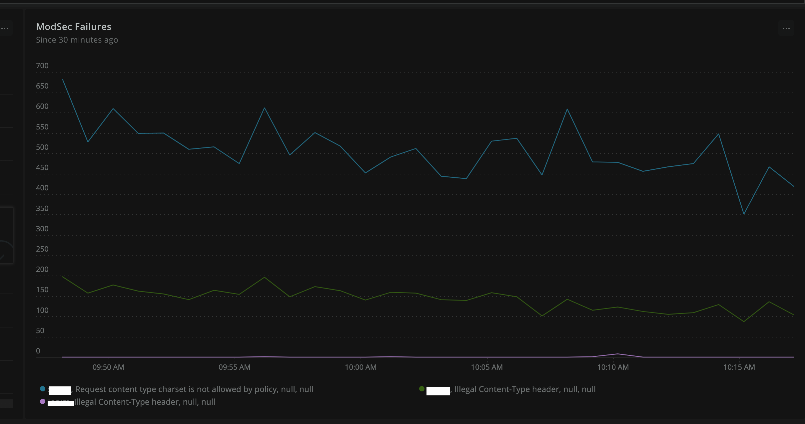

# Compliance and Security Controls

Facets.cloud encourages secure practices and out of the box security tools. This enables any cluster launched through facets.cloud
to be easier for compliance with minimal involvement of technology team in the process.
>Facets.cloud doesn't provide any proprietary tools for security rather aim to integrate with existing opensource and 
> paid tool options. The scope of the compliance here is the cloud security parts only that is launched and managed by facets.cloud

Depending on the industry you operate in, the following standards may be applicable to you
* ISO
* PCI DSS
* SOC-2

Broadly, the cloud security scope falls into the following areas

## Infrastructure Security Practices

### Deployment of Facets.cloud
Facets.cloud is deployed on the customer's premises as a licensed solution. It is recommended that
this is deployed in a standalone AWS account following [AWS Organizations](https://aws.amazon.com/organizations/) best practices. 
This excludes any thirdparty infrastructure to come additionally in the security and complaince scope.

### High level deployment model

Any cluster deployed through Facets.cloud follows best practices of the cloud vendor. For e.g., in the case of AWS, the 
underlying infrastructure contains an EKS cluster hosted inside a VPC. By default, there is no direct connectivity to the EKS 
cluster from outside unless an application explicitly specifies it. This specification if provided, goes through the Stack definition of the application
and hence checked in a git repository. Apart from the advantages of this practice being declarative in nature, specific to security and compliance - 
* Named (Who created/updated it)
* Version controlled 
* Process controlled (Secondary sign-off using PR Reviews)
* easily auditable 

## Antivirus (HIDS)

[ClamAV](https://www.clamav.net/) are installed in every node launched by Facets. Facets is responsible for updating and ensuring 
the ClamAV agents are running all the time. 
>ClamAV antivirus scan results are pushed to a permanent storage from which
the results can be downloaded.

## Security Information and Event Management (SIEM)
Facets.cloud comes with pre-integration with [Falco](https://falco.org/). Falco provides the cloud-native runtime security
and is the de-facto Kubernetes threat detection engine. Falco ships with a default set of rules that check the kernel for unusual behaviors. Read 
the falco features [here](https://falco.org/docs/). 

>Any cluster launched by Facets contains prometheus and grafana by default. Falco output metrics are parsed and sent to 
prometheus for the infromation security team to monitor and custommize the standard dashboards provided by Facets. 
Additionally, if a paid tool like [Newrelic](https://newrelic.com/) is enabled, these metrics automatically gets pushed to Newrelic for a cluster-wide view.

## Firewall (NIDS)
A cloud launched by Facets will have [ModSecurity](https://github.com/SpiderLabs/ModSecurity) installed at the ingress points.
> Any application developer who wants to expose a web server port to the outside world must define an ingress rule in the 
> application stack definition. Facets injects [ModSecurity](https://github.com/SpiderLabs/ModSecurity) with [OWASP ModSecurity Core Rule Set](https://github.com/coreruleset/coreruleset). 
> Similar to Falco, the output is sent to prometheus/grafana and can be optionally relayed to third party monitoring tools like Newrelic as well. 
> An information Security personnel can write required rules for alerting.

## Security Practices

### Network, Security and IAM

* All resources are provisioned by Facets during the cluster launch and update based on CredentialRequests. The credentials 
requested by any application is only available to that application.
* QA, Stage and production environments are created separately in Facets and they don't share anything
* All physical resources are created in private subnet of the VPC and only uses a NAT gateway for outbound traffic  
* By default, no network traffic is allowed to the network with deny-all policies. Any application that needs an ingress route
is injected by a [ModSecurity](https://github.com/SpiderLabs/ModSecurity) WAF. This is as per the DMZ (De-Militarized Zone)
best practices.   
  

### Secrets, Encryption and Key management

* Database, Cloud resource secrets are requested by the applications in the stack definitions and fulfilled by facets at the cluster launch. This eliminates any need
of a manual password or access creation that can potentially expose risk of leakage.
* All PVCs are encrypted and cloud-native databases like Aurora are provisioned with the best practice security policies.
* Certificate management happpens on the cloud provider like AWS certificate manager and required SSL and TLS configurations adopted that 
are recommended by the cloud provider.
  

### Access Control

* Just in time, temporary credentials are issued in the Facets control plane for anyone who wants to access the kubernetes
cluster for maintenance activities. This token expires in 24 hours.
* The user privileges are controlled by the admins of Facets control plane.
* Any management port exposed that is required to be exposed by the application/service uses a **tools** ingress that is 
password protected. Facets comes with pre-integration with Zero trust Application Access systems such as [Cloudflare Access](https://www.cloudflare.com/teams/access/).
  

