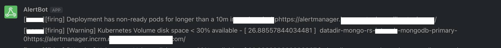

# Observability
The following are usually the three levers to build in-depth observability to your application deployments in production environment
* Metrics
* Logs
* Tracing

## Metrics
The deployments created through Facets ships with a built-in [Grafana](https://grafana.com/) and [Prometheus](https://prometheus.io/) set up with pre-integrations to standard components and relevant dashboards.
The Grafana dashboard can be accessed through the control plane or with cluster specific URLs by the develops, devops and support staff.


The metrics collected by Prometheus are usually of the following types
* Infrastructure Metrics (Pre-built metric exporters)
* Application Metrics ([Open telemetry](https://opentelemetry.io/))

### Infrastructure Metrics
Any components instantiated through Facets comes with the relevant pre-built metrics dashboards. The following
graphs shows a pre-built redis dashboard. 


### Application Metrics

Facets.cloud adopts [Open Telemetry](https://opentelemetry.io/) standards for pushing metrics. Applications expose metrics as end-points and declare it as a
monitoring object inside the FSDL application specifications. Facets.cloud instruments the scraping of these metrics out of the application metrics end-points and submits to Prometheus.

### User Defined Dashboards

Dashboards can also be defined in Facet stack definition language by committing the exported json from grafana into the stack definition
>place the json file in **/dashboards/instances** directory in your stack

### Metrics Integrations with third party tools

You can use your favourite third-party tools like Newrelic to visualize the metrics apart
from the Grafana dashboard. The Newrelic pre-integration relays metrics from prometheus to Newrelic without any other code change
to the application.
>Add `NEWRELIC_LICENSE_KEY` to the Common Environment Variables to enable the pre-integration. The following shows the earlier
> redis dashboard on newrelic.


## Logs

>Facets expects all application containers to log to `system.out`. For most languages, this can be achieved by using a console appender to the code. 

Facets uses fluentd to relay logs and presents various options of log collection. 
### NFS with object storage as backup
This option usually translates to an EFS with S3 if the deployment is on AWS cloud. This option by default acts as
the source of truth of all the log storage at a single place. The logs are organized as folders in `application/containers` and get pushed to S3 
at configured time interval.The logs can be accessed through a [Wetty](https://www.npmjs.com/package/wetty) terminal after a required authorization by the user. Older logs can be downloaded from s3 on need-basis on the same console.


### Additional logging substacks
* [ELK](https://www.elastic.co/what-is/elk-stack) - Additional to EFS/NFS as logging, an ELK substack can be chosen to index and search the logs. 
Depending on the log volumes produced by the applications per-day, this may be an effective solution
* More log collection options are in development ..   
  
  


## Traces

>Facets doesn't provide any tracing integrations yet. Tracing is usually instrumented inside the application code.


## Alerts

All active and inactive alerts can be obtained through `Alerts` dropdown in the control plane. 


The set of alerts can be categorized in to two parts
1. Standard Alerts - Facets ships standard alerts with each component that is defined in the stack. 
2. User defined Alerts - Additionally, alerts can be defined in [PromQL](https://prometheus.io/docs/prometheus/latest/querying/basics/) and committed in
the stack git repo, which will be automatically available in all deployments

   These Alerts can be defined in Facet stack definition language by committing the **alertmanager yaml** into the stack definition
>place the yaml file in **/alerts/instances** directory in your stack

Sample Yaml File:
   ````
    - name: mongo.rules
      rules:
    - alert: MongoRelicaStatusSecondaryCrit
      expr: mongodb_mongod_replset_member_state{state="SECONDARY"} != 2
      for: 2m
      labels:
      severity: critical
      team: infra
      resourceType: mongo
      resourceName: "{{ $labels.pod_name }}"
      annotations:
      message: MongoDB secondary replica status down
   ````
   The alerts can be pushed to ChatOPs tools like Slack or flock. Any team that has added the corresponding module as an observer,  
receives the alert for that module by the channel updates.


   