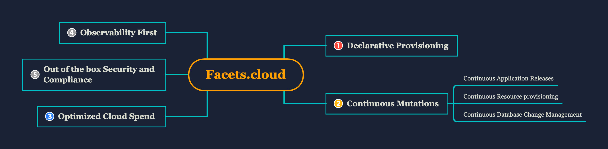
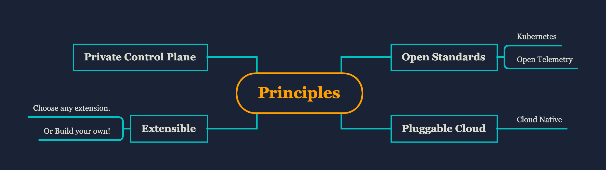
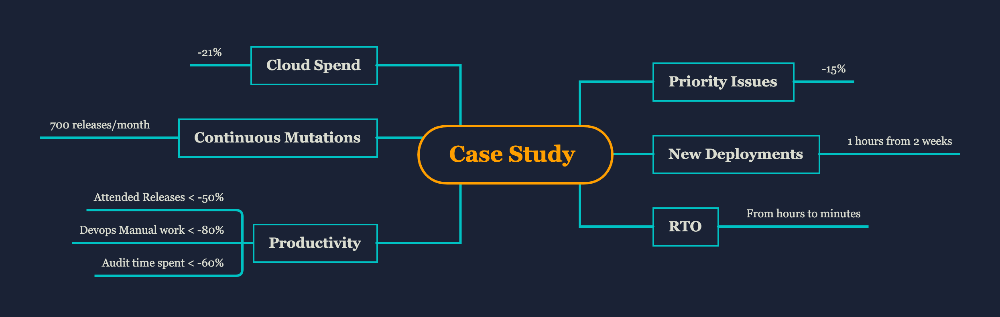

# About Facets.cloud

[Facets.cloud](https://www.facets.cloud/) is a cloud automation platform for Developers and DevSecOps. Facets.cloud simplifies provisioning and change management of applications, infrastructure components and databases on multiple cloud platforms.

## Salient Features

Any deployment provisioned through Facets.cloud automatically gets continuous deployments, observability, Security practices and disaster recovery features.

**1. Declarative Provisioning**

Define your complete product stack (blueprint) in an easy to write Facets.cloud Stack Definition Language (JSON). The blueprint contains application definitions, cloud resources, database specifications and the dependencies between them.  The blueprint is version/access controlled and any number of deployments can be manifested out of it. These deployments can be QA, Staging, Load Test or multiple production environments on different cloud providers.

**2. Continuous Mutations**

Once deployed through Facets.cloud, the entire deployment can receive continuous mutations. These mutations can be regular application releases integrated with the CI systems or can be changes to resources like Databases, queues and their properties. Facets.cloud ensures that all changes are consistently deployed across all deployments of the stack.

**3. Optimized cloud cost**

Any deployment provisioned through Facets.cloud gets the best practice implementation for auto-scaling, spot utilization for optimal cloud spend. Additionally, since all resources and their dependencies are accounted for in the blueprint, the cost leakage is minimized.

**4. Observability First**

Facets.cloud components are developed with observability first approach. Infrastructure, application and cloud resource metrics get aggregated and pre-built dashboards and well-researched alerts are auto-configured. The alerts are pushed to chat-ops tools and custom notification channels.

**5. Built-in Security and compliance**

Deployments receive best practice point-to-site connectivity for developers and devops with role based access control. Networks, Security, SSL certificates are auto provisioned and managed by Facets. Antivirus, OSSEC tools come built-in with pre-built dashboards for monitoring and compliance. Facets.cloud ensures all critical components like Databases are backed by a disaster recovery solution.

## How is Facets.cloud built?

Facets.cloud is built on open standards like Kubernetes, Open Telemetry. It leverages the best of the offerings of the cloud providers by being cloud native and at the same time supports multiple cloud platforms and local development environments.

Please find a demonstration of a sample application deployment [here](https://www.facets.cloud/docs/#/getting_started/demo).

## About the Company

Facets.cloud is an independent entity that is incubated under [Capillary Technologies](https://www.capillarytech.com/), a leading SaaS product in the customer engagement sector. Currently, it manages applications hosted on several thousands of nodes provisioned on AWS public cloud. Facets.cloud has helped in reducing 15% of production issues emerging from automation gaps.

## Key Terminologies
>**Stack** - Stack is a blueprint that defines the components of a Product (Microservices, infrastructure) and relationships between them.
 
>**Cluster** - Cluster is the physical manifestation of the stack in a cloud like AWS. One stack can have many clusters like QA, Pre prod, Production 1, Production 2 etc.

>**Control Plane** - Control plane is a UI for defining deploying and managing stacks and clusters. This UI is private to each customer and can be used to deploy multiple stacks and clusters.

## Watch Facets in Action

* [A sample deployment](getting_started/demo.md)
