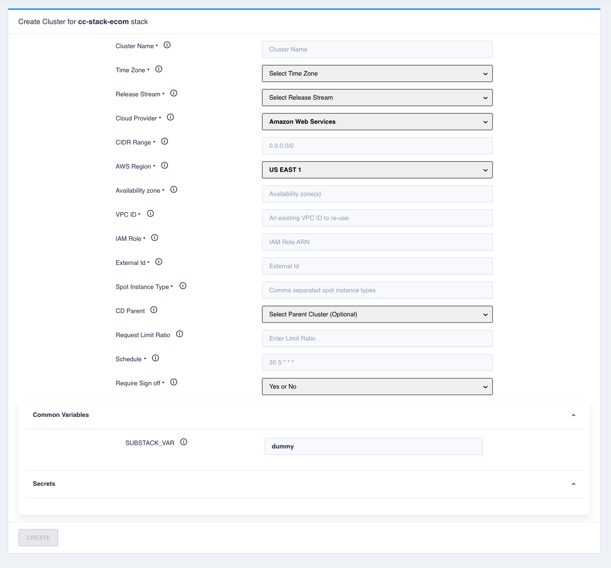

# Creating a Cluster

To create a cluster, select the stack on Control Plane and click “Create Cluster“. Choose the Cloud Provided and fill in
the details.

If the stack has cluster level variables/secrets defined values for those need to be provided at creation time.

