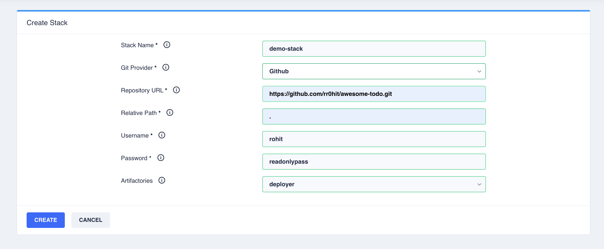

# Create a stack

By now you must be familiar with the concept of a stack.

## Git Repository

Create a Github/Bitbucket git repository. To get started, a stack.json file would qualify the repository as a valid
stack.

```json
{
  "clusterVariablesMeta": {
  },
  "stackVariables": {
  }
}
```

## Register Stack on Control Plane

Navigate to Create Stack button on the Control Plane and fill in the details.



## Creating an Application Definition

An application may be defined by placing a json file in application/instances directory in stack.

```json
{
  "size": "SMALL",
  "deploymentStrategy": "RollingUpdate",
  "elbIdleTimeoutSeconds": 300,
  "protocolGroup": "tcp",
  "scaling": {
    "hpaEnabled": true,
    "hpaMinReplicas": 1,
    "hpaMaxReplicas": 1,
    "hpaMetricThreshold": 60
  },
  "liveness": {
    "enableLivenessTCP": true,
    "livenessPort": 8080,
    "livenessInitialDelay": 60,
    "livenessTimeout": 10,
    "livenessFailureThreshold": 20,
    "livenessPeriod": 60,
    "livenessSuccessThreshold": 1
  },
  "readiness": {
    "enableReadinessTCP": true,
    "readinessInitialDelay": 30,
    "readinessFailureThreshold": 8,
    "readinessSuccessThreshold": 1,
    "readinessPort": 8080,
    "readinessTimeout": 10,
    "readinessPeriod": 60
  },
  "ports": [
    {
      "name": "http",
      "containerPort": 8080,
      "lbPort": 80
    }
  ],
  "build": {
    "ci": "deployer",
    "id": "5e301d0aa4a81300073aba10"
  },
  "credentialRequests": {
    "dbs": {
      "mysql": [
        {
          "resourceType": "mysql",
          "resourceName": "billdump",
          "permission": "READ_WRITE",
          "environmentVariables": [
            {
              "userName": "INTOUCH_DB_MYSQL_FILESERVICE_USERNAME",
              "password": "INTOUCH_DB_MYSQL_FILESERVICE_PASSWORD"
            }
          ]
        }
      ],
      "mongo": []
    },
    "queues": {
      "rabbitmq": []
    },
    "cloud": [
      {
        "resourceType": "s3",
        "resourceName": "fileservice",
        "permission": "READ_WRITE"
      },
      {
        "resourceType": "s3",
        "resourceName": "reon-etl-data",
        "permission": "READ_WRITE"
      },
      {
        "resourceType": "s3",
        "resourceName": "campaigns",
        "permission": "READ_WRITE"
      },
      {
        "resourceType": "s3",
        "resourceName": "sharingan",
        "permission": "READ_WRITE"
      },
      {
        "resourceType": "s3",
        "resourceName": "nsadmindata",
        "permission": "READ_WRITE"
      }
    ]
  },
  "environmentVariables": {
    "static": {
      "XMX_VALUE": "1573m",
      "XMS_VALUE": "1573m"
    },
    "dynamic": {
      "FILESERVICE_BUCKET": {
        "resourceType": "s3",
        "resourceName": "fileservice",
        "attribute": "bucket_name"
      },
      "CAMPAIGNS_FILESERVICE_BUCKET_NAME": {
        "resourceType": "s3",
        "resourceName": "campaigns",
        "attribute": "bucket_name"
      },
      "NSADMINDATA_FILESERVICE_BUCKET_NAME": {
        "resourceType": "s3",
        "resourceName": "nsadmindata",
        "attribute": "bucket_name"
      }
    }
  },
  "k8s_service_names": [
    "fileservice"
  ],
  "ingress_rules": [
    {
      "ingress": "demoingress",
      "path": "/",
      "targetPort": 3000,
      "domainPrefix": "fileservice."
    }
  ],
  "resourceAllocationStrategy": "GENERAL_PURPOSE"
}
```

### Size

Pod sizing to use as define in sizing json. ResourceAllocationStrategy drives which sizing family to use.

### Deployment Strategy

Supported deployment strategies are RollingUpdate and Replace

### Protocol Group

Protocol groups maybe TCP or UDP

### Scaling Configurations

HPA configurations

### Liveliness/Readiness Probes

Liveliness or readiness probes maybe a Port Check, HTTP Probe or a Script probe. The three modes maybe switched by
setting the boolean flags enableLivenessTCP, enableLivenessHTTP or enableLivenessEXEC. For Script probe,
readinessCommand or livenessCommand arrays define the command to run.

### Ports

Declare the ports

### Build Selection

Images are selected based on the ci system (deployer), id of the build job (deployer id), and the release stream
selected for the cluster.

### Credential Management

Credential requests can inject usernames and passwords for databases/queues into environment variables. These users are
created dynamically. Cloud credential requests are fulfilled using cloud specific mechanisms (Eg. kube2iam for aws)

### Static Environment Variables

Static environment variables are tuning parameters like Xmx or threadPool counts. These may be readjusted at a cluster
level using overrides from the control plane.

### Dynamic Environment Variables

Dynamic environment variables may be used to inject attributes of other resources for eg. S3 bucket name, SQS queue name
etc into application environment variables.

### Service Discovery

A Kubernetes service with the same name as the json file name in the default namespace is created. If any specific
service name is desired that maybe specified using k8s_service_names

### Ingress

An application may be exposed outside the Kubernetes cluster using an ingress. An ingress resource needs to be defined
which may be internal (accessible within VPC) or external (accessible via internet). Applications can add rules to
direct traffic at them using ingress_rules field in application definition. Rules may be path based or subdomain based.
Empty subdomain implies the cluster base domain as defined in the ingress resource is used.

## Application Sizing

The pod sizings to be used can be predefined in a stack. The convention is to have different sizing families viz.
CPU_INTENSIVE, GENERAL_PURPOSE etc. The files have to be named:

application/sizing.{SIZING_FAMILY}.json

Example:

application/sizing.CPU_INTENSIVE.json

```json
{
  "SMALL": {
    "podCPULimit": 1,
    "podMemoryLimit": 2
  },
  "LARGE": {
    "podCPULimit": 2,
    "podMemoryLimit": 4
  },
  "XLARGE": {
    "podCPULimit": 3,
    "podMemoryLimit": 6
  },
  "XXLARGE": {
    "podCPULimit": 6,
    "podMemoryLimit": 10
  },
  "TINY": {
    "podCPULimit": 0.5,
    "podMemoryLimit": 1
  },
  "MICRO": {
    "podCPULimit": 0.25,
    "podMemoryLimit": 0.5
  }
}
```

## Common Environment Variables

### Stack Variables

Any fixed environment variables that need to be injected into all applications maybe defined using stackVariables field
in stack.json

### Cluster Variables

Any variables that need to be define per cluster maybe declared using clusterVariablesMeta field in stack.json

Example:

```json
{
  "clusterVariablesMeta": {
    "NEWRELIC_KEY": {
      "value": "default"
    },
    "NEWRELIC_LICENSE_KEY": {
      "value": "default"
    },
    "NEW_RELIC_LICENSE_KEY": {
      "value": "default"
    },
    "NEWRELIC_INSERT_KEY": {
      "secret": true,
      "value": "default"
    }
  }
}
```

The variables can be set at cluster creation or from the overview page. These variables are injected as environment
variables to all application pods.

## Ingress definitions

An ingress may be define by creating a definition in ingress/instances/ directory. Example:

###Internal 

ingress/instances/demointernal.json

```json
{
  "base_domain" : "demo.internal",
  "subdomains" : [],
  "default_ingress": false,
  "basic_auth_enabled": false,
  "ingress_rules" : [],
  "internal": true
}
```

Applications may add ingress rules by adding ingress_rules in their definitions.

Eg:

```json
"ingress_rules": [
    {
      "ingress": "demointernal",
      "path": "/",
      "targetPort": 3000,
      "domainPrefix": "fs."
    }
  ]
```
This would result in all HTTP traffic to fs.martjack.internal getting directed at the app.

###External
ingress/instances/demoexternal.json
```json
{
  "base_domain" : "demo.facets.cloud",
  "subdomains" : [],
  "default_ingress": true,
  "basic_auth_enabled": false,
  "ingress_rules" : [],
  "internal": false
}
```

As this is not an external ingress, the domain naming convention is {clusterName}.{base_domain}. The above mentioned ingress rule applied to an external ingress would result in a public endpoint:

>fs.{clusterName}.demo.facets.cloud

